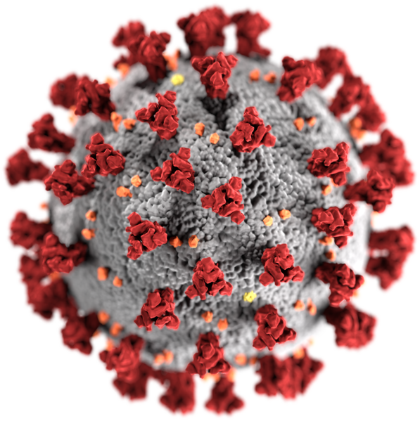

# COVID-19-Detection-using-Transfer-Learning.

## COVID-19:
Coronavirus disease (COVID-19) is an infectious disease caused by a newly discovered coronavirus.

Most people infected with the COVID-19 virus will experience mild to moderate respiratory illness and recover without requiring special treatment. Older people, and those with underlying medical problems like cardiovascular disease, diabetes, chronic respiratory disease, and cancer are more likely to develop serious illness.

The best way to prevent and slow down transmission is be well informed about the COVID-19 virus, the disease it causes and how it spreads. Protect yourself and others from infection by washing your hands or using an alcohol based rub frequently and not touching your face.

The COVID-19 virus spreads primarily through droplets of saliva or discharge from the nose when an infected person coughs or sneezes, so it’s important that you also practice respiratory etiquette (for example, by coughing into a flexed elbow).

At this time, there are no specific vaccines or treatments for COVID-19. However, there are many ongoing clinical trials (some have shown some significant ouput) evaluating potential treatments. WHO will continue to provide updated information as soon as clinical findings become available.

# Symptoms:

### Most common symptoms:
- fever.
- dry cough.
- tiredness.

### Less common symptoms:

- aches and pains.
- sore throat.
- diarrhoea.
- conjunctivitis.
- headache.
- loss of taste or smell.
- a rash on skin, or discolouration of fingers or toes.

### Serious symptoms:

- difficulty breathing or shortness of breath.
- chest pain or pressure.
- loss of speech or movement.

# Prevention:

To prevent infection and to slow transmission of COVID-19, do the following:

- Wash your hands regularly with soap and water, or clean them with alcohol-based hand rub.
- Maintain at least 1 metre distance between you and people coughing or sneezing.
- Avoid touching your face.
- Cover your mouth and nose when coughing or sneezing.
- Stay home if you feel unwell.
- Refrain from smoking and other activities that weaken the lungs.
- Practice physical distancing by avoiding unnecessary travel and staying away from large groups of people.

In this notebook, COVID-19 detection is performed using the [COVID-19 Chest X-ray](https://www.kaggle.com/bachrr/covid-chest-xray) Image Dataset. The dataset contains chest X-ray images of normal and COVID-19 affected patients. Here, a convolutional neural network is adopted to extract features and classify images as normal and COVID-19 affected.

***If you face trouble loading the notebook, you can check it out here [COVID-19 detection using transfer learning](https://www.kaggle.com/alifrahman/covid-19-detection-using-transfer-learning)***
